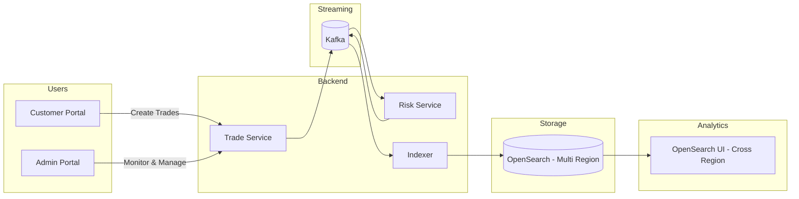

# 🚀 FX Trade Analytics Platform (AWS + OpenSearch)


> Build a **real-world distributed FX analytics system** powered by Kafka, OpenSearch, and AWS cross-region capabilities.

---

# 📸 Screenshots (Add Your Images Here)

## 🖥️ OpenSearch Dashboards


## 📊 Grafana Metrics


## 🧠 Kafka UI


---

# 🌍 Core Idea (What makes this project special)

This project demonstrates how to build a **global analytics platform** using:

🔥 **AWS OpenSearch Cross-Region UI Access**

- Query data across multiple AWS regions
- No data replication required
- No endpoint switching
- Supports cross-account + cross-region
- Works with IAM + Identity Center

👉 This enables **centralized analytics on globally distributed trading data** while keeping data local.

---

# 🎬 System Overview



---

# 🔁 Daily Developer Workflow (Recommended)

## 🟢 Step 1 — Start Infra

```bash
npm run local:docker:up
```

## 🟡 Step 2 — Start Apps

```bash
npm run local:app:run-all
npm run local:ui:run-all
```

---

# 🎯 One Command Mode

```bash
npm run local:start
npm run local:status
npm run local:stop
```

---

# 🌐 Access URLs

| Service | URL |
|--------|-----|
| Trade API | http://localhost:8080 |
| Risk Service | http://localhost:8081 |
| Indexer | http://localhost:8082 |
| OpenSearch | http://localhost:9200 |
| Dashboards | http://localhost:5601 |
| Grafana | http://localhost:3000 |
| Prometheus | http://localhost:9090 |
| Jaeger | http://localhost:16686 |

---

# 🔥 Highlights

- Event-driven microservices
- Real-time analytics pipeline
- Cross-region OpenSearch analytics
- Clean developer workflow
- Production-style observability
