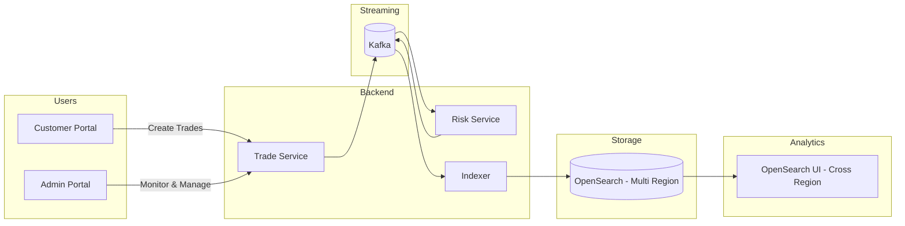

# 🚀 FX Trade Analytics Platform (AWS + OpenSearch)


---

## 📑 Table of Contents

- [🎥 Demo (System in Action)](#-demo-system-in-action)
- [📸 Screenshots](#-screenshots)
- [🧠 Architecture Diagram (Editable)](#-architecture-diagram-editable)
- [🌍 Core Idea](#-core-idea-what-makes-this-project-special)
- [🎬 System Overview](#-system-overview)
- [🔁 Daily Developer Workflow](#-daily-developer-workflow-recommended)
- [🎯 One Command Mode](#-one-command-mode)
- [🌐 Access URLs](#-access-urls)
- [🧭 OpenSearch Use Cases You Can Build on This Codebase](#-opensearch-use-cases-you-can-build-on-this-codebase)
  - [Region-Local Use Cases (single OpenSearch domain)](#region-local-use-cases-single-opensearch-domain)
    - [Trade lifecycle & operations](#trade-lifecycle--operations)
    - [Risk monitoring](#risk-monitoring)
    - [Volume & P&L analytics](#volume--pl-analytics)
    - [Compliance & audit (region-bound)](#compliance--audit-region-bound)
    - [Pipeline observability](#pipeline-observability)
  - [Unified / Cross-Region Use Cases (OpenSearch UI federation)](#unified--cross-region-use-cases-opensearch-ui-federation)
    - [Global situational awareness](#global-situational-awareness)
    - [Cross-region risk & compliance](#cross-region-risk--compliance)
    - [Cross-region aggregations](#cross-region-aggregations)
    - [Federated search](#federated-search)
    - [Multi-region operations & cost](#multi-region-operations--cost)
    - [Adjacent extensions (scaffolding ready)](#adjacent-extensions-scaffolding-ready)
- [🔥 Highlights](#-highlights)

---

# 🎥 Demo (System in Action)

> _Demo recording pending. Drop the file at_ `docs/screenshots/demo.gif` _and the embed below will render._
> Record with QuickTime (Mac), OBS Studio, or Loom — then export as GIF.

<!--  -->

---

# 📸 Screenshots

> _Screenshots pending. Drop PNGs into_ `docs/screenshots/` _at the paths below and uncomment the embeds._

## 🖥️ OpenSearch Dashboards
> Expected at `docs/screenshots/opensearch-dashboard.png`
<!--  -->

## 📊 Grafana Metrics
> Expected at `docs/screenshots/grafana-dashboard.png`
<!--  -->

## 🧠 Kafka UI
> Expected at `docs/screenshots/kafka-ui.png`
<!--  -->

---

# 🧠 Architecture Diagram (Editable)

👉 File location:
docs/architecture/fx-architecture.drawio

👉 Open in:
https://app.diagrams.net

> Build a **real-world distributed FX analytics system** powered by Kafka, OpenSearch, and AWS cross-region capabilities.

---

# 🌍 Core Idea (What makes this project special)

This project demonstrates how to build a **global analytics platform** using:

🔥 **AWS OpenSearch Cross-Region UI Access**

- Query data across multiple AWS regions
- No data replication required
- No endpoint switching
- Supports cross-account + cross-region
- Works with IAM + Identity Center

👉 This enables **centralized analytics on globally distributed trading data** while keeping data local.

---

# 🎬 System Overview



---

# 🔁 Daily Developer Workflow (Recommended)

## 🟢 Step 1 — Start Infra

```bash
npm run local:docker:up
```

## 🟡 Step 2 — Start Apps

```bash
npm run local:app:run-all
npm run local:ui:run-all
```

---

# 🎯 One Command Mode

```bash
npm run local:start
npm run local:status
npm run local:stop
```

---

# 🌐 Access URLs

| Service | URL |
|--------|-----|
| Trade API | http://localhost:8080 |
| Risk Service | http://localhost:8081 |
| Indexer | http://localhost:8082 |
| OpenSearch | http://localhost:9200 |
| Dashboards | http://localhost:5601 |
| Grafana | http://localhost:3000 |
| Prometheus | http://localhost:9090 |
| Jaeger | http://localhost:16686 |

---

# 🧭 OpenSearch Use Cases You Can Build on This Codebase

This codebase is a **reference implementation** for FX trade analytics — but the OpenSearch patterns it ships with apply to any high-volume, region-partitioned event stream. Use cases split into two camps:

- **Region-Local** — built against a single OpenSearch domain (e.g. `fx-trades-us-east-1`). Each regional desk owns its own data, low latency, residency-bound.
- **Unified / Cross-Region** — built against the index pattern `fx-trades-*` via the new [OpenSearch UI cross-region data access](https://aws.amazon.com/about-aws/whats-new/2026/05/opensearch-ui-cross-region-data-access-domains/) feature (May 2026). Federates queries across all regional domains as a single pane of glass — without moving any data.

> **Index naming convention:** every trade is indexed into `fx-trades-{region}` — so a query against `fx-trades-eu-west-1` is region-local, and `fx-trades-*` is unified.

---

## Region-Local Use Cases (single OpenSearch domain)

These run inside one Region against one domain. Data residency preserved, latency local, no cross-region permissions needed.

### Trade lifecycle & operations
| Use case | OpenSearch query shape |
|---|---|
| Real-time trading-floor heads-up display | `term:region` + `range:timestamp` + `sort:timestamp desc` |
| Latest N trades per trader book | `term:traderBook` + `sort:timestamp desc` + `size:N` |
| Trade ticket lookup by ID | `term:tradeId` |
| Recent activity for a single currency pair | `term:fromCurrency` + `term:toCurrency` |

### Risk monitoring
| Use case | OpenSearch query shape |
|---|---|
| Risk-distribution dashboard for the desk | `terms` aggregation on `riskLevel` |
| HIGH-risk trade queue (for manual review) | `term:riskLevel=HIGH` + `range:timestamp` |
| Spike detection on HIGH-risk count | `date_histogram` on `timestamp` + filtered by `riskLevel=HIGH` |
| Per-trader-book risk profile | `terms:traderBook` + sub-agg `terms:riskLevel` |

### Volume & P&L analytics
| Use case | OpenSearch query shape |
|---|---|
| Per-region volume by currency pair | `terms:fromCurrency,toCurrency` + `sum:fromAmount` |
| Trade rate over time (live tick chart) | `date_histogram:timestamp` + `count` |
| Top trader books by notional | `terms:traderBook` + `sum:fromAmount` + `size:N` |
| Average / p95 trade size per pair | `terms:pair` + `avg/percentiles:fromAmount` |

### Compliance & audit (region-bound)
| Use case | Why region-local matters |
|---|---|
| MiFID II transaction reporting (EU region) | EU data must stay in EU — `fx-trades-eu-west-1` only |
| RBI India localization reporting | Same, for `fx-trades-ap-south-1` |
| MAS Singapore trade-data access | Domain-bound queries, never federated |
| GDPR Article 15 subject-data export | Per-region, no cross-border movement |
| Audit trail replay for a specific session | `range:timestamp` within one regional index |

### Pipeline observability
| Use case | OpenSearch query shape |
|---|---|
| Per-region indexer throughput | `date_histogram:timestamp` + `count` on the region's index |
| Per-region pipeline lag (ingest vs index) | Compare `timestamp` vs `_doc.@indexed_at` (if added) |
| DLQ inspection (per-service DLQ topic) | Combined with Kafka UI; OpenSearch logs the originally indexed events |

---

## Unified / Cross-Region Use Cases (OpenSearch UI federation)

These query `fx-trades-*` from a **single OpenSearch UI application**. The UI federates the query at runtime — data stays in its origin region, only result rows travel back. Compliance preserved, egress minimised.

### Global situational awareness
| Use case | What it answers |
|---|---|
| Global trading book consolidated view | "What are all my desks doing right now, anywhere in the world?" |
| Live worldwide trade volume + risk dashboard | One Kibana / OpenSearch UI dashboard across regions |
| Top currency pairs by global volume (24h) | `terms:fromCurrency,toCurrency` over `fx-trades-*` |
| Global head-of-desk ops view | Per-region columns in a single dashboard |

### Cross-region risk & compliance
| Use case | What it answers |
|---|---|
| Global HIGH-risk trade hunt | "Show me all HIGH-risk USD trades, last 24h, anywhere" |
| Cross-region wash-trade detection | Joins on `traderBook` × `pair` × `time-window` across regions |
| Cross-region anomaly / coordinated-activity hunt | Same trader, multiple regions, same minute |
| AML investigation across borders | Transactions for a counterparty across all regional domains |
| Group-level oversight | One compliance officer, all jurisdictions, one query |

### Cross-region aggregations
| Use case | OpenSearch query shape |
|---|---|
| Cross-region P&L roll-up by trader book | `terms:traderBook` + `sum:fromAmount` over `fx-trades-*` |
| Currency pair volume rankings (global) | `terms:fromCurrency,toCurrency` + `cardinality:tradeId` |
| Time-series global trade rate | `date_histogram:timestamp` + per-region sub-agg |
| Per-region performance comparison | `terms:region` + `avg:fromAmount`, etc. |
| Global risk distribution heatmap | `terms:region` × `terms:riskLevel` |

### Federated search
| Query | Pattern |
|---|---|
| "All USD/INR HIGH-risk trades, last 24h, anywhere" | `fx-trades-*` + `term:fromCurrency=USD` + `term:toCurrency=INR` + `term:riskLevel=HIGH` + `range:timestamp` |
| "All trades for trader-book FX-BOOK across regions" | `fx-trades-*` + `term:traderBook=FX-BOOK` |
| "Tradeid lookup federated" | `fx-trades-*` + `term:tradeId=...` |
| "Region-A trades that involve a Region-B currency" | `fx-trades-*` + filter on `region` and currency code |

### Multi-region operations & cost
| Use case | What it answers |
|---|---|
| Multi-region platform-health dashboard | One Kibana for indexer health across all clusters |
| Cross-region indexer DLQ visibility | Federated count + drill-down for `*-dlq` index |
| Cost / volume tracking across regions | `terms:region` + `sum:fromAmount` and document counts |
| Combined cross-account + cross-region tenant view | Multi-account orgs see all environments at once |

### Adjacent extensions (scaffolding ready)
The same Kafka → enrichment → OpenSearch indexing pattern naturally extends to:
| Extension | What changes |
|---|---|
| **Sanctions screening (OFAC, EU, UK SDN lists)** | Swap currency-pair allow-list for sanctions list; trade-service plumbing identical |
| **AML pattern detection** | Add a graph-aware enrichment service consuming the same Kafka topic |
| **Counterparty credit-limit checking** | New consumer next to `risk-service`; same DLQ patterns |
| **Real-time market-data overlay** | Additional indexer writing rate quotes to `fx-rates-{region}`; UI joins via lookup |
| **Multi-jurisdiction transaction reporting** | Existing trade index is the source-of-truth; reports run as scheduled aggregations per region |

---

# 🔥 Highlights

- Event-driven microservices
- Real-time analytics pipeline
- Cross-region OpenSearch analytics
- Clean developer workflow
- Production-style observability
