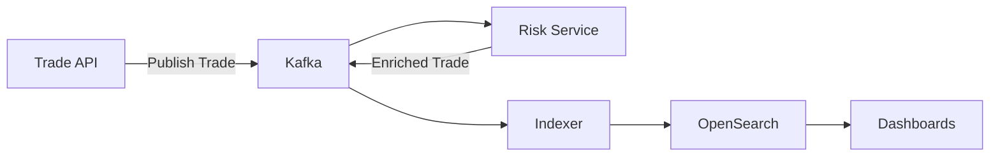
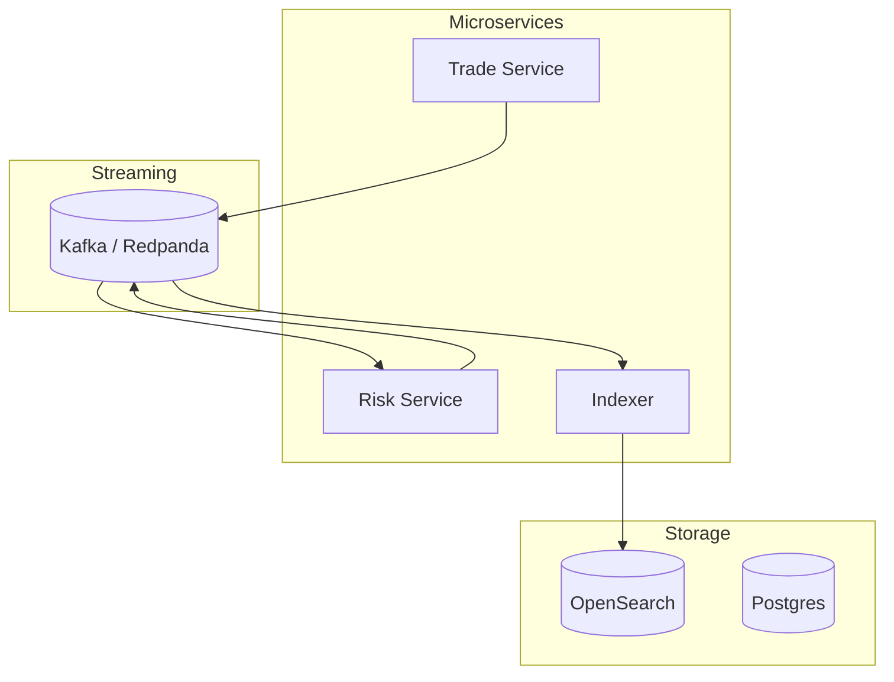
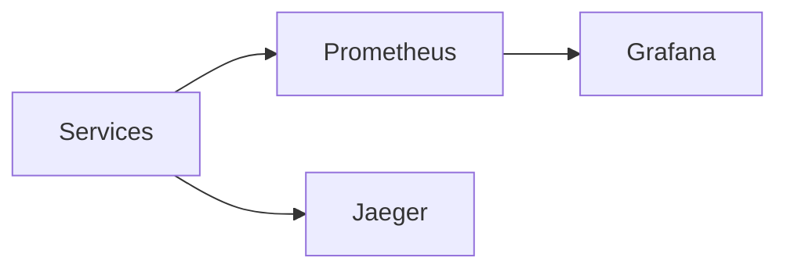

# 🚀 FX Trade Analytics Platform (AWS + OpenSearch)

> Build a **real-world distributed system** for FX trade analytics using Kafka, OpenSearch, and Spring Boot microservices.

---

# 🌍 Why This Project Matters

Modern trading platforms require:
- Real-time event processing
- Distributed microservices
- Cross-region analytics
- Observability at scale

This project demonstrates **all of the above in one system**.

---

# 🎬 System Flow (End-to-End)



---

# 🧠 Architecture Deep Dive



---

# ⚡ Developer Onboarding (First Time)

```bash
npm install
chmod +x devops/local/*.sh
docker network create fx-trade-analytics-aws-opensearch-network
```

### 🚀 Start Infra (ONLY ONCE / when needed)

```bash
npm run local:docker:up
```

👉 This starts:
- Kafka
- OpenSearch
- Postgres
- Grafana / Prometheus

👉 **Data is persisted (volumes), so no data loss unless you run cleanup scripts**

---

# 🔁 Daily Developer Workflow

## 🚀 Start Apps (FAST, repeatable)

```bash
npm run local:app:run-all
npm run local:ui:run-all
```

OR

```bash
npm run local:start
```

---

## 🔍 Check status

```bash
npm run local:status
```

---

## 🛑 Stop Apps ONLY (recommended daily)

```bash
npm run local:stop
```

👉 Stops apps + docker cleanly

---

# ⚠️ Important Note on Data

| Command | Data Impact |
|--------|------------|
| docker up | ✅ safe |
| docker down | ✅ safe |
| docker down -v | ❌ deletes data |

👉 Your setup uses volumes → **data is safe across restarts**

---

# 🧱 System Components

| Component | Role |
|----------|-----|
| Trade Service | Accepts trades |
| Risk Service | Calculates risk |
| Indexer | Sends to OpenSearch |
| Kafka | Event backbone |
| OpenSearch | Analytics engine |
| Grafana | Metrics dashboards |
| Prometheus | Metrics collection |
| Jaeger | Tracing |

---

# 📊 Observability



---

# 🌐 Access URLs

| Service | URL |
|--------|-----|
| Trade API | http://localhost:8080 |
| Risk Service | http://localhost:8081 |
| Indexer | http://localhost:8082 |
| OpenSearch | http://localhost:9200 |
| Dashboards | http://localhost:5601 |
| Grafana | http://localhost:3000 |
| Prometheus | http://localhost:9090 |
| Jaeger | http://localhost:16686 |

---

# 🎯 One Command Mode

```bash
npm run local:start
npm run local:status
npm run local:stop
```

---

# 🔥 Highlights

- Event-driven microservices
- Real-time analytics pipeline
- One-command platform control
- Production-style observability

---

# 🚀 Next Steps

- AWS multi-region deployment
- Advanced dashboards
- Kafka DLQ + retry
- Security (Auth + RBAC)
