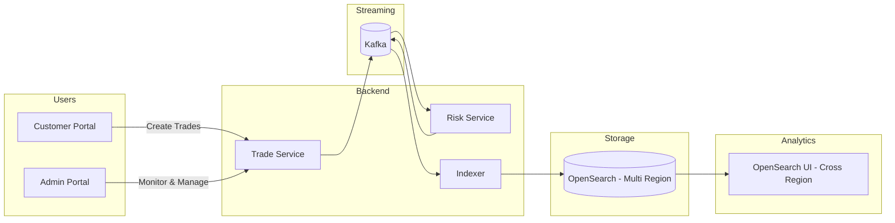

# 🚀 FX Trade Analytics Platform (AWS + OpenSearch)


---

## 📑 Table of Contents

- [🎥 Demo (System in Action)](#-demo-system-in-action)
- [📸 Screenshots](#-screenshots)
- [🧠 Architecture Diagram (Editable)](#-architecture-diagram-editable)
- [🌍 Core Idea](#-core-idea-what-makes-this-project-special)
- [🎬 System Overview](#-system-overview)
- [🔁 Daily Developer Workflow](#-daily-developer-workflow-recommended)
- [🎯 One Command Mode](#-one-command-mode)
- [🌐 Access URLs](#-access-urls)
- [🧭 OpenSearch Use Cases You Can Build on This Codebase](#-opensearch-use-cases-you-can-build-on-this-codebase)
  - [Region-Local Use Cases (single OpenSearch domain)](#region-local-use-cases-single-opensearch-domain)
    - [Trade lifecycle & operations](#trade-lifecycle--operations)
    - [Risk monitoring](#risk-monitoring)
    - [Volume & P&L analytics](#volume--pl-analytics)
    - [Compliance & audit (region-bound)](#compliance--audit-region-bound)
    - [Pipeline observability](#pipeline-observability)
  - [Unified / Cross-Region Use Cases (OpenSearch UI federation)](#unified--cross-region-use-cases-opensearch-ui-federation)
    - [Global situational awareness](#global-situational-awareness)
    - [Cross-region risk & compliance](#cross-region-risk--compliance)
    - [Cross-region aggregations](#cross-region-aggregations)
    - [Federated search](#federated-search)
    - [Multi-region operations & cost](#multi-region-operations--cost)
    - [Adjacent extensions (scaffolding ready)](#adjacent-extensions-scaffolding-ready)
- [🔥 Highlights](#-highlights)
- [🛠️ AWS OpenSearch Implementation Plan](#️-aws-opensearch-implementation-plan)
  - [Goal](#goal)
  - [Prerequisites — AWS Management Console setup](#prerequisites--aws-management-console-setup-before-running-anything)
  - [Next steps — what to do after IAM setup](#next-steps--what-to-do-after-iam-setup)
  - [Deployment modes](#deployment-modes)
  - [Provider abstraction (factory pattern)](#provider-abstraction-factory-pattern)
  - [Pagination strategy](#pagination-strategy)
  - [GitHub Actions workflows for AWS provisioning](#github-actions-workflows-for-aws-provisioning)
  - [Open design decisions](#open-design-decisions)
  - [Companion document](#companion-document)

---

# 🎥 Demo (System in Action)

> _Demo recording pending. Drop the file at_ `docs/screenshots/demo.gif` _and the embed below will render._
> Record with QuickTime (Mac), OBS Studio, or Loom — then export as GIF.

<!--  -->

---

# 📸 Screenshots

> _Screenshots pending. Drop PNGs into_ `docs/screenshots/` _at the paths below and uncomment the embeds._

## 🖥️ OpenSearch Dashboards
> Expected at `docs/screenshots/opensearch-dashboard.png`
<!--  -->

## 📊 Grafana Metrics
> Expected at `docs/screenshots/grafana-dashboard.png`
<!--  -->

## 🧠 Kafka UI
> Expected at `docs/screenshots/kafka-ui.png`
<!--  -->

---

# 🧠 Architecture Diagram (Editable)

👉 File location:
docs/architecture/fx-architecture.drawio

👉 Open in:
https://app.diagrams.net

> Build a **real-world distributed FX analytics system** powered by Kafka, OpenSearch, and AWS cross-region capabilities.

---

# 🌍 Core Idea (What makes this project special)

This project demonstrates how to build a **global analytics platform** using:

🔥 **AWS OpenSearch Cross-Region UI Access**

- Query data across multiple AWS regions
- No data replication required
- No endpoint switching
- Supports cross-account + cross-region
- Works with IAM + Identity Center

👉 This enables **centralized analytics on globally distributed trading data** while keeping data local.

---

# 🎬 System Overview



---

# 🔁 Daily Developer Workflow (Recommended)

All scripts follow the pattern `localhost:app:<category>:<action>`.

## 🟢 Step 1 — Start Infra (Kafka, OpenSearch, Kafka UI)

```bash
npm run localhost:app:infra:all-up
```

## 🟡 Step 2 — Start Services + UI

```bash
npm run localhost:app:services:all-up      # 4 Spring services via concurrently
npm run localhost:app:ui:all-up            # both portals + auto-opens browsers
```

Or both with one command:

```bash
npm run localhost:app:services-ui:all-up
```

---

# 🎯 One Command Mode (everything: infra + services + UI)

```bash
npm run localhost:app:all:all-up
npm run localhost:app:all:all-status
npm run localhost:app:all:all-down
```

# 🐘 Postgres mode (opt-in — H2 stays the default)

```bash
npm run localhost:app:postgres:run-all     # starts container, waits, runs Liquibase, then services
npm run localhost:app:postgres:down        # tear down (drops volume)
```

The `postgres:run-all` flow uses the production-shape pattern: a one-shot migration runner (`postgres,migrate` profile, exits on completion) followed by service pods running with Liquibase disabled (`postgres,no-migrate`). This is the same shape as the future EKS deployment (Helm pre-upgrade Job + Deployment).

---

# 🌐 Access URLs

| Service | URL |
|--------|-----|
| Trade API | http://localhost:8080 |
| Risk Service | http://localhost:8081 |
| Indexer | http://localhost:8082 |
| OpenSearch | http://localhost:9200 |
| Dashboards | http://localhost:5601 |
| Grafana | http://localhost:3000 |
| Prometheus | http://localhost:9090 |
| Jaeger | http://localhost:16686 |

---

# 🧭 OpenSearch Use Cases You Can Build on This Codebase

This codebase is a **reference implementation** for FX trade analytics — but the OpenSearch patterns it ships with apply to any high-volume, region-partitioned event stream. Use cases split into two camps:

- **Region-Local** — built against a single OpenSearch domain (e.g. `fx-trades-us-east-1`). Each regional desk owns its own data, low latency, residency-bound.
- **Unified / Cross-Region** — built against the index pattern `fx-trades-*` via the new [OpenSearch UI cross-region data access](https://aws.amazon.com/about-aws/whats-new/2026/05/opensearch-ui-cross-region-data-access-domains/) feature (May 2026). Federates queries across all regional domains as a single pane of glass — without moving any data.

> **Index naming convention:** every trade is indexed into `fx-trades-{region}` — so a query against `fx-trades-eu-west-1` is region-local, and `fx-trades-*` is unified.

---

## Region-Local Use Cases (single OpenSearch domain)

These run inside one Region against one domain. Data residency preserved, latency local, no cross-region permissions needed.

### Trade lifecycle & operations
| Use case | OpenSearch query shape |
|---|---|
| Real-time trading-floor heads-up display | `term:region` + `range:timestamp` + `sort:timestamp desc` |
| Latest N trades per trader book | `term:traderBook` + `sort:timestamp desc` + `size:N` |
| Trade ticket lookup by ID | `term:tradeId` |
| Recent activity for a single currency pair | `term:fromCurrency` + `term:toCurrency` |

### Risk monitoring
| Use case | OpenSearch query shape |
|---|---|
| Risk-distribution dashboard for the desk | `terms` aggregation on `riskLevel` |
| HIGH-risk trade queue (for manual review) | `term:riskLevel=HIGH` + `range:timestamp` |
| Spike detection on HIGH-risk count | `date_histogram` on `timestamp` + filtered by `riskLevel=HIGH` |
| Per-trader-book risk profile | `terms:traderBook` + sub-agg `terms:riskLevel` |

### Volume & P&L analytics
| Use case | OpenSearch query shape |
|---|---|
| Per-region volume by currency pair | `terms:fromCurrency,toCurrency` + `sum:fromAmount` |
| Trade rate over time (live tick chart) | `date_histogram:timestamp` + `count` |
| Top trader books by notional | `terms:traderBook` + `sum:fromAmount` + `size:N` |
| Average / p95 trade size per pair | `terms:pair` + `avg/percentiles:fromAmount` |

### Compliance & audit (region-bound)
| Use case | Why region-local matters |
|---|---|
| MiFID II transaction reporting (EU region) | EU data must stay in EU — `fx-trades-eu-west-1` only |
| RBI India localization reporting | Same, for `fx-trades-ap-south-1` |
| MAS Singapore trade-data access | Domain-bound queries, never federated |
| GDPR Article 15 subject-data export | Per-region, no cross-border movement |
| Audit trail replay for a specific session | `range:timestamp` within one regional index |

### Pipeline observability
| Use case | OpenSearch query shape |
|---|---|
| Per-region indexer throughput | `date_histogram:timestamp` + `count` on the region's index |
| Per-region pipeline lag (ingest vs index) | Compare `timestamp` vs `_doc.@indexed_at` (if added) |
| DLQ inspection (per-service DLQ topic) | Combined with Kafka UI; OpenSearch logs the originally indexed events |

---

## Unified / Cross-Region Use Cases (OpenSearch UI federation)

These query `fx-trades-*` from a **single OpenSearch UI application**. The UI federates the query at runtime — data stays in its origin region, only result rows travel back. Compliance preserved, egress minimised.

### Global situational awareness
| Use case | What it answers |
|---|---|
| Global trading book consolidated view | "What are all my desks doing right now, anywhere in the world?" |
| Live worldwide trade volume + risk dashboard | One Kibana / OpenSearch UI dashboard across regions |
| Top currency pairs by global volume (24h) | `terms:fromCurrency,toCurrency` over `fx-trades-*` |
| Global head-of-desk ops view | Per-region columns in a single dashboard |

### Cross-region risk & compliance
| Use case | What it answers |
|---|---|
| Global HIGH-risk trade hunt | "Show me all HIGH-risk USD trades, last 24h, anywhere" |
| Cross-region wash-trade detection | Joins on `traderBook` × `pair` × `time-window` across regions |
| Cross-region anomaly / coordinated-activity hunt | Same trader, multiple regions, same minute |
| AML investigation across borders | Transactions for a counterparty across all regional domains |
| Group-level oversight | One compliance officer, all jurisdictions, one query |

### Cross-region aggregations
| Use case | OpenSearch query shape |
|---|---|
| Cross-region P&L roll-up by trader book | `terms:traderBook` + `sum:fromAmount` over `fx-trades-*` |
| Currency pair volume rankings (global) | `terms:fromCurrency,toCurrency` + `cardinality:tradeId` |
| Time-series global trade rate | `date_histogram:timestamp` + per-region sub-agg |
| Per-region performance comparison | `terms:region` + `avg:fromAmount`, etc. |
| Global risk distribution heatmap | `terms:region` × `terms:riskLevel` |

### Federated search
| Query | Pattern |
|---|---|
| "All USD/INR HIGH-risk trades, last 24h, anywhere" | `fx-trades-*` + `term:fromCurrency=USD` + `term:toCurrency=INR` + `term:riskLevel=HIGH` + `range:timestamp` |
| "All trades for trader-book FX-BOOK across regions" | `fx-trades-*` + `term:traderBook=FX-BOOK` |
| "Tradeid lookup federated" | `fx-trades-*` + `term:tradeId=...` |
| "Region-A trades that involve a Region-B currency" | `fx-trades-*` + filter on `region` and currency code |

### Multi-region operations & cost
| Use case | What it answers |
|---|---|
| Multi-region platform-health dashboard | One Kibana for indexer health across all clusters |
| Cross-region indexer DLQ visibility | Federated count + drill-down for `*-dlq` index |
| Cost / volume tracking across regions | `terms:region` + `sum:fromAmount` and document counts |
| Combined cross-account + cross-region tenant view | Multi-account orgs see all environments at once |

### Adjacent extensions (scaffolding ready)
The same Kafka → enrichment → OpenSearch indexing pattern naturally extends to:
| Extension | What changes |
|---|---|
| **Sanctions screening (OFAC, EU, UK SDN lists)** | Swap currency-pair allow-list for sanctions list; trade-service plumbing identical |
| **AML pattern detection** | Add a graph-aware enrichment service consuming the same Kafka topic |
| **Counterparty credit-limit checking** | New consumer next to `risk-service`; same DLQ patterns |
| **Real-time market-data overlay** | Additional indexer writing rate quotes to `fx-rates-{region}`; UI joins via lookup |
| **Multi-jurisdiction transaction reporting** | Existing trade index is the source-of-truth; reports run as scheduled aggregations per region |

---

# 🔥 Highlights

- Event-driven microservices
- Real-time analytics pipeline
- Cross-region OpenSearch analytics
- Clean developer workflow
- Production-style observability

---

# 🛠️ AWS OpenSearch Implementation Plan

> **Status:** Design phase — no code yet. Consolidates the design decisions for showcasing the new [AWS OpenSearch UI cross-region data access](https://aws.amazon.com/about-aws/whats-new/2026/05/opensearch-ui-cross-region-data-access-domains/) feature (May 1, 2026) using this codebase.

## Goal

Showcase **AWS OpenSearch UI cross-region data access** end-to-end on this codebase by:

1. Standing up **AWS OpenSearch domains in three regions** (`us-east-1`, `eu-west-1`, `ap-south-1`) via GitHub Actions workflows.
2. Letting the application — **whether running locally on a laptop or deployed to ECS** — write into the right regional OpenSearch domain based on each trade's `region` field.
3. Running the **AWS-managed OpenSearch UI in `us-east-1`** that federates queries across all three regional domains as a single pane of glass — without moving data.
4. Building a **companion search view in the admin portal** with region radio buttons (single-region only; cross-region demo lives in the AWS UI).

## Prerequisites — AWS Management Console setup before running anything

Do these **once per AWS account** before `npm run localhost:app:aws:setup:iam-all` (or any GitHub Actions workflow) will work. All clicks happen in the [AWS Management Console](https://console.aws.amazon.com).

### 1 · Have an AWS account

Sign up at [aws.amazon.com](https://aws.amazon.com) if you don't have one. Free Tier covers most experimentation; the project resources (OpenSearch domains, NAT gateways, etc.) are paid — budget roughly **~$350/mo** while the 7-region demo is running, **~$70/mo** when domains are paused.

### 2 · Create a dedicated bootstrap admin IAM user

**Don't use your root account access keys** — AWS strongly discourages it, and you can't delete root keys cleanly. Create a dedicated IAM user that exists only for the one-time bootstrap.

1. Sign in to the AWS Console.
2. Go to **IAM** (in the search bar) → **Users** in the left sidebar.
3. Click **Create user** (top-right).
4. **User name**: `fx-bootstrap-admin` (or any name you prefer — this is the one-time admin, *not* the deployer that workflows use).
5. **Provide user access to the AWS Management Console**: leave this **UNCHECKED**. This user only needs programmatic access (CLI / API).
6. Click **Next**.
7. **Permissions options**: select **Attach policies directly**.
8. In the policy search box, type `AdministratorAccess` and check the box next to it.
9. Click **Next** → **Create user**.

> ✋ The screen at this point is for **creating an IAM User**. If you accidentally end up at a "Create role" screen with a "Custom trust policy" editor, back out — you're in the wrong place. Roles are different from users, and we want a User here.

### 3 · Generate an access key for that user

1. Click into the user you just created (`fx-bootstrap-admin`).
2. Open the **Security credentials** tab.
3. Scroll to **Access keys** → click **Create access key**.
4. **Use case**: pick **Application running outside AWS** (or **Command Line Interface**).
5. Click **Next** (description is optional) → **Create access key**.
6. **Save the Secret access key NOW.** It is shown only once. The Access key ID can be retrieved later, but the secret cannot.

### 4 · Install the local CLI tools the bootstrap script depends on

```bash
# macOS (Homebrew)
brew install awscli jq

# Linux (Debian/Ubuntu)
sudo apt update && sudo apt install -y awscli jq
```

Verify both are on `PATH`:

```bash
aws --version    # → aws-cli/2.x.x
jq --version     # → jq-1.x
```

### 5 · Export the bootstrap admin credentials in your shell

```bash
export FX_TRADE_ANALYTICS_AWS_ACCESS_KEY=<Access key id from step 3>
export FX_TRADE_ANALYTICS_AWS_SECRET=<Secret access key from step 3>
# Optional (defaults to us-east-1; IAM is global so any region works):
export AWS_REGION=us-east-1
```

These are project-namespaced env vars so they don't collide with any shell-wide `AWS_*` you may already have. The script reads them and maps to standard `AWS_*` internally.

### 6 · Run the IAM bootstrap

```bash
npm run localhost:app:aws:setup:iam-all
```

The script (idempotent on the first 5 steps) creates:
- Customer Managed Policy `fx-trade-opensearch-policy`
- IAM Group `fx-trade-opensearch-deployers`
- IAM User `fx-trade-opensearch-github-deployer`
- Group membership
- A fresh access-key pair for the deployer user

The new keys are printed to your terminal. **You'll use them twice — once for GitHub workflows, once for local Spring services.**

#### 6a · Copy into GitHub repo secrets (for GitHub Actions workflows)

Settings → Secrets and variables → Actions → New repository secret:

| Secret name | Value |
|---|---|
| `AWS_ACCESS_KEY_ID`     | from script output |
| `AWS_SECRET_ACCESS_KEY` | from script output |

### 7 · Generate the local secrets file (for local Spring services)

The same deployer keys go into `./application-local-secrets.yml` so Spring services running on your laptop can authenticate to AWS (the OpenSearch deployment sync feature, the indexer's SigV4 writes to AWS OpenSearch, etc.). The file is **gitignored** — never checked in.

Don't copy by hand — there's a generator command:

```bash
# Either project-namespaced env vars (preferred):
export FX_DEPLOYER_AWS_ACCESS_KEY_ID=<Access key id from step 6 output>
export FX_DEPLOYER_AWS_SECRET_ACCESS_KEY=<Secret access key from step 6 output>
# OR standard AWS env vars (fallback):
# export AWS_ACCESS_KEY_ID=<Access key id from step 6 output>
# export AWS_SECRET_ACCESS_KEY=<Secret access key from step 6 output>

npm run localhost:app:secrets:generate
```

The script writes `./application-local-secrets.yml` (mode `600`) and tells you what to do next. Need a refresher on env vars / what files get written?

```bash
npm run localhost:app:secrets:help
```

The structure of the generated file is documented in the committed template at [`application-local-secrets-template.yml`](application-local-secrets-template.yml). Every Spring service that needs AWS credentials reads this same file via `spring.config.import: optional:file:./application-local-secrets.yml`.

### 8 · Clean up

```bash
unset FX_TRADE_ANALYTICS_AWS_ACCESS_KEY FX_TRADE_ANALYTICS_AWS_SECRET
```

(Or just close the shell.) Optionally, in the AWS Console, **delete the access keys on `fx-bootstrap-admin`** (Security credentials tab → Actions → Delete) — you don't need them again unless you re-run the bootstrap (e.g. to update the policy or add another deployer).

You're ready. Every workflow under `.github/workflows/` can now run.

> 📖 Detailed walkthrough + troubleshooting in [`.github/aws/configs/README.md`](.github/aws/configs/README.md). Common terminology pitfalls (Roles vs Users, trust policy errors) covered there.

## Next steps — what to do after IAM setup

You now have repo secrets `AWS_ACCESS_KEY_ID` + `AWS_SECRET_ACCESS_KEY` backed by a deployer IAM user. Here's the recommended order to validate everything works and get to a running multi-region demo.

### Step 8 · Smoke-test in one region first

Don't run `995-AWS-All-Setup` straight away — it provisions everything across 7 regions; any auth issue would waste 15+ minutes. Start small:

1. **Actions** tab → click **`004-AWS-Setup-Region-OpenSearch`** → **Run workflow** (top-right)
2. Inputs:
   - `regions = us-east-1`
   - `environment = dev`
3. Click **Run workflow**

Expected: ~15 minutes for the OpenSearch domain to provision. Watch the workflow logs for green checkmarks. If you see auth errors, your repo secrets are wrong — re-check step 6.

#### What's happening behind the scenes (and where to watch it in AWS Console)

The workflow runs `aws cloudformation deploy` against the [`region-opensearch.yml`](.github/aws/cloudformation/region-opensearch.yml) template. Two AWS console screens give you live visibility while the GitHub workflow is still running:

**a) CloudFormation — watch the stack come up resource-by-resource**

- Open the [AWS Console](https://console.aws.amazon.com/) and switch the **region selector (top-right)** to **us-east-1**.
- Search for and open **CloudFormation**.
- You'll see a stack named **`fx-dev-opensearch-us-east-1`** in the list (appears within ~10s of the workflow starting).
- Click it. Tabs to look at:
  | Tab | What it shows |
  |---|---|
  | **Events** | Live timeline of every resource being created, in order. Most useful tab. |
  | **Resources** | Which AWS resources have been provisioned (just one — `AWS::OpenSearchService::Domain`). |
  | **Outputs** | After CREATE_COMPLETE: the domain endpoint URL, ARN, and name. Same values the workflow log prints. |
  | **Parameters** | The values passed in (Environment, RegionCode, InstanceType, etc.). |
- Status progression: `CREATE_IN_PROGRESS` → `CREATE_COMPLETE` (~15 min). If it goes to `CREATE_FAILED` → `ROLLBACK_COMPLETE`, expand the **Events** tab and the **first failed event** (red icon) tells you the root cause.

**b) OpenSearch Service — watch the domain itself**

- Same region (us-east-1) → search **OpenSearch Service**.
- Left sidebar → **Domains**.
- A domain named **`fxs-dev-us-east-1`** appears once CloudFormation gets to the `Domain` resource (a few minutes in).
- Status moves: `Loading` (~10-15 min) → `Active`. Once Active, the domain is ready to receive index/search calls.

**If the workflow fails:**

The setup workflows have **auto-recovery built in** — they detect failed terminal states (`ROLLBACK_COMPLETE`, `ROLLBACK_FAILED`, `CREATE_FAILED`, etc.) and delete the stuck stack automatically before re-creating. So in most cases you can just **re-run the workflow** and it self-heals.

Manual cleanup is only needed if:

- The stack is stuck in a transitional `*_IN_PROGRESS` state (another deploy is mid-flight — wait for it to finish)
- The stack is in some unusual state the workflow doesn't auto-handle (it'll error out and tell you to inspect in the AWS Console)

For the rare manual case:

- AWS Console → CloudFormation → select `fx-dev-opensearch-us-east-1` → **Delete** button. Confirm. Wait ~5 min for `DELETE_COMPLETE`.
- Or via CLI:
  ```bash
  aws cloudformation delete-stack --stack-name fx-dev-opensearch-us-east-1 --region us-east-1
  aws cloudformation wait stack-delete-complete --stack-name fx-dev-opensearch-us-east-1 --region us-east-1
  ```
- Then re-run the GitHub workflow.

### Step 9 · Verify in the AWS Console

- Switch to **us-east-1** (region selector, top-right of the AWS Console).
- Open **OpenSearch Service** → **Domains** in the left sidebar.
- You should see a domain named **`fxs-dev-us-east-1`** in `Active` state.
- Click into it → the **Domain endpoint** shown here is what the application will eventually connect to. Save the URL — you'll need it in step 11.

### Step 10 · Provision the rest of the regions

Once step 8 was clean:

- **Add more regions one at a time:** re-run `004-AWS-Setup-Region-OpenSearch` with e.g. `regions=eu-west-2,ap-south-1`.
- **All 7 at once (Balanced demo set):** `regions=all`.
- **Full chain** (`995-AWS-All-Setup` with `regions=all`) — this also provisions VPCs, IAM roles, and ECR repos. You only need this when you're ready to deploy services to ECS later. For the pure local-app + AWS-OpenSearch demo, you can skip it.

> 💰 **Cost reminder:** ~$50/mo per OpenSearch domain on `t3.small.search`. 7 regions ≈ $350/mo running, ~$70/mo idle. Pause domains between work sessions to save (AWS Console → Domain → Actions → Pause).

### Step 11 · Run the local app writing to AWS OpenSearch

> ⏳ **Pending:** This requires Phase 2 (`fx-search-client` Maven module) to be built first. Until then, the application writes only to localhost OpenSearch (the existing dev flow under [Daily Developer Workflow](#-daily-developer-workflow-recommended)).

When Phase 2 lands, the steps will be:

1. **Get each AWS OpenSearch domain endpoint.** From the AWS Console (step 9) or via CLI:
   ```bash
   aws cloudformation describe-stacks --region us-east-1 \
     --stack-name fx-dev-opensearch-us-east-1 \
     --query 'Stacks[0].Outputs[?OutputKey==`DomainEndpoint`].OutputValue' --output text
   ```
2. **Drop them into `application.yml`** for `fx-trade-service` and `fx-opensearch-indexer`:
   ```yaml
   fx.opensearch.backends:
     - region: us-east-1
       provider: aws
       endpoint: https://fxs-dev-us-east-1-XXXXXX.us-east-1.es.amazonaws.com
     - region: eu-west-2
       provider: aws
       endpoint: https://fxs-dev-eu-west-2-YYYYYY.eu-west-2.es.amazonaws.com
   ```
3. **Make sure your local `~/.aws/credentials` profile** can reach those domains (the indexer SigV4-signs requests with that profile). The `fx-trade-opensearch-github-deployer` user from the IAM bootstrap is fine — just configure a profile with its keys:
   ```bash
   aws configure --profile fx-trade-opensearch
   # Access Key ID:     <AWS_ACCESS_KEY_ID from step 6>
   # Secret Access Key: <AWS_SECRET_ACCESS_KEY from step 6>
   # Region:            us-east-1
   export AWS_PROFILE=fx-trade-opensearch
   ```
4. **Start the local stack** as today:
   ```bash
   npm run localhost:app:infra:all-up      # Kafka + OpenSearch
   npm run localhost:app:services:all-up   # 4 Spring services — now writing to AWS OpenSearch by region
   npm run localhost:app:ui:all-up         # admin + customer portals
   ```
5. **Place a trade** in the customer portal — the trade flows through Kafka, the risk service classifies it, the indexer SigV4-signs the write to the AWS OpenSearch domain that matches the trade's `region` field.
6. **Verify** the doc landed in AWS:
   ```bash
   curl -X GET "https://<your-domain-endpoint>/fx-trades-us-east-1/_search" \
     --aws-sigv4 "aws:amz:us-east-1:es" \
     --user "$AWS_ACCESS_KEY_ID:$AWS_SECRET_ACCESS_KEY"
   ```

### What comes after that

The full implementation roadmap (11 phases, ~70 tasks) lives in [`README_OpenSearch_Core_Impl_DevPlan.md`](README_OpenSearch_Core_Impl_DevPlan.md). Key upcoming phases:

| Phase | Adds | Why you'd want it |
|---|---|---|
| **Phase 2** | `fx-search-client` factory module | Unlocks step 11 above |
| **Phase 3** | Indexer multi-region routing            | Per-region writes work end-to-end |
| **Phase 4** | Trade-service search API refactor       | Search by region from the app |
| **Phase 5** | Customer entity + region binding        | Customers tied to a home region |
| **Phase 6** | Admin portal Trades Search view         | In-portal multi-region search UI |
| **Phase 8** | AWS OpenSearch UI app cross-region setup | The headline demo — single UI federating across regions |

The architectural reasoning behind each decision is in the **Reference** sections below (Deployment modes, Provider abstraction, Pagination strategy, Open design decisions) and the design doc [`docs/design/AWS-OpenSearch-Cross-Region-Use-Cases.md`](docs/design/AWS-OpenSearch-Cross-Region-Use-Cases.md).

---

## Deployment modes

Same code, different config:

| Mode | Compute lives | OpenSearch lives | When |
|---|---|---|---|
| **Local dev** | Developer's laptop | AWS OpenSearch domains (3 regions) | While building & recording the demo |
| **AWS** | ECS Fargate (per region) | AWS OpenSearch domains (same 3) | Production target |

The OpenSearch domains are the **same set of AWS-managed instances** in both modes. Only the compute origin changes.

## Provider abstraction (factory pattern)

Application talks to OpenSearch through a **factory that returns a stateless, region-keyed singleton client**. Each region's client is built once at startup with the right transport:

| Region's `provider` | Transport | Auth |
|---|---|---|
| `local` | Apache HTTP | None |
| `aws`   | `AwsSdk2Transport` from `opensearch-java` | SigV4 (uses local AWS profile in dev, ECS task role in prod) |
| _(future)_ `azure`, `gcp` | TBD | TBD |

**One SDK** (`opensearch-java`), two transports — not two SDKs. AWS provider only does data plane (`index`, `search`); control-plane operations (create/delete domains) live in the GitHub Actions CloudFormation workflows.

**Config schema (illustrative):**
```yaml
fx.opensearch.backends:
  - region: us-east-1
    provider: aws
    endpoint: https://fx-trades-use1.us-east-1.es.amazonaws.com
  - region: eu-west-1
    provider: aws
    endpoint: https://fx-trades-euw1.eu-west-1.es.amazonaws.com
  - region: ap-south-1
    provider: aws
    endpoint: https://fx-trades-aps1.ap-south-1.es.amazonaws.com
  - region: local-dev
    provider: local
    endpoint: http://localhost:9200
```

## Pagination strategy

Server cap: **200 hits per page** (for `_source` retrieval; aggregations exempt).
Client UX: **20 rows per visible page** → 10 client pages per server chunk.

| Behaviour | Implementation |
|---|---|
| Total count | Returned with every search response (cheap in OpenSearch) |
| Prefetch trigger | When the user reaches client page 9 of 10, prefetch the next 200 |
| Client cache | Sliding window of recent chunks (LRU); invalidated on filter/sort change |
| Pagination type | Start with `from/size` (≤ 2k results); upgrade to `search_after` cursor if scaling demands |

## GitHub Actions workflows for AWS provisioning

All workflows are **manual-trigger** (`workflow_dispatch`), prefixed by sequence number. New OpenSearch workflows extend the existing 001/002/003 family. Each workflow accepts a **multi-select region input** (one or more or all). Operations are **idempotent** — if the resource already exists, gracefully skip and log.

| Workflow | What it does |
|---|---|
| `001-AWS-Initial-Setup-VPC` | Per region: create new VPC **or** reuse an existing VPC if its ID is supplied as input |
| `001-AWS-Destroy-VPC` | Tear down VPCs created by the setup workflow (skips supplied/existing) |
| `004-AWS-Setup-Region-OpenSearch` | Per selected region: create AWS OpenSearch domain. Skip-if-exists with informational message. |
| `004-AWS-Destroy-Region-OpenSearch` | Per selected region: delete the OpenSearch domain |
| `995-AWS-All-Setup` | Orchestrator — runs all setup workflows in dependency order |
| `996-AWS-All-Destroy` | Orchestrator — runs all destroy workflows in reverse order |

Existing workflows `002-AWS-Initial-Setup-IAM-Roles` and `003-AWS-Initial-Setup-ECR` (and their destroy pairs) remain unchanged; the new OpenSearch workflows slot in at `004`.

## Open design decisions

These need answers before any code is written. The full discussion lives in `README_OpenSearch_Core_Impl_DevPlan.md`.

| # | Decision | My recommendation |
|---|---|---|
| **1** | `createOrder` vs `placeTrade` — same thing? | Same — keep existing `POST /api/trades/place` name |
| **2** | What is `publishIndex`? (REST endpoint, internal step, or rename of Kafka→indexer?) | Internal indexer write — not a new REST endpoint |
| **3** | Is `local` OpenSearch still in scope as a provider? | Yes — for offline iteration; AWS is what the demo shows |
| **4** | Why `cloudProvider` in every request DTO? | Make it optional override; default comes from server config keyed by `region` |
| **5** | Pagination cache scope | Sliding window of recent chunks (LRU), invalidated on filter/sort change |
| **6** | Prefetch direction | Forward only on initial impl; bidirectional later if needed |
| **7** | "AWS OpenSearch SDK" — which one? | `opensearch-java` + `AwsSdk2Transport` (data plane). NOT the v2 control-plane SDK |
| **8** | App-side cross-region search | Skip — single region only in app; federation belongs to AWS OpenSearch UI |
| **9** | Customer impersonation for demo recording | Add admin "view as customer X" button |
| **10** | OpenSearch domains — public or VPC | Public for demo; document VPC variant |
| **11** | Provision OpenSearch domains now or after workflow? | After workflow — build the workflow first, use it once |
| **12** | Numbering convention for new OpenSearch workflows | `004` (next after existing `001/002/003`) |
| **13** | Where does the search-client factory live? | New module `fx-search-client` (cleanest), shared by trade-service + indexer |
| **14** | VPC strategy per region | Mixed — workflow accepts optional VPC ID per region; creates new where not supplied |

## Companion document

See **[`README_OpenSearch_Core_Impl_DevPlan.md`](README_OpenSearch_Core_Impl_DevPlan.md)** for the full task breakdown — categorized by phase with status tracking, dependencies, and acceptance criteria. This README captures the **what**; the dev plan captures the **how, in what order, and what's done**.
