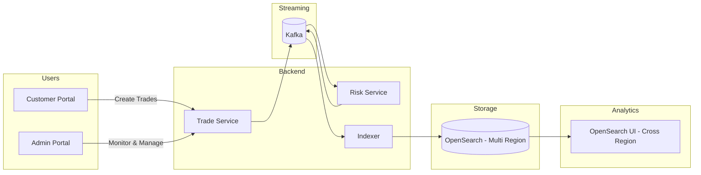
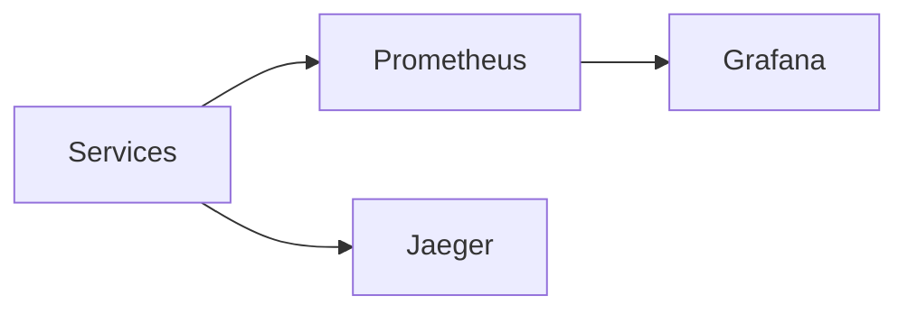

# 🚀 FX Trade Analytics Platform (AWS + OpenSearch)

> Build a **real-world distributed FX analytics system** powered by Kafka, OpenSearch, and AWS cross-region capabilities.

---

# 🌍 Core Idea (What makes this project special)

This project demonstrates how to build a **global analytics platform** using:

🔥 **AWS OpenSearch Cross-Region UI Access**

- Query data across multiple AWS regions
- No data replication required
- No endpoint switching
- Supports cross-account + cross-region
- Works with IAM + Identity Center

👉 This enables **centralized analytics on globally distributed trading data** while keeping data local.

---

# 🎬 System Overview



---

# 🧠 What Each Layer Does

| Layer | Purpose |
|------|--------|
| Customer Portal | Submit FX trades |
| Admin Portal | Monitor trades, risk, analytics |
| Trade Service | Accept & publish trades |
| Risk Service | Enrich trades with risk |
| Indexer | Push data to OpenSearch |
| Kafka | Event streaming backbone |
| OpenSearch | Distributed analytics store |
| OpenSearch UI | Cross-region unified analytics |

---

# 🌐 Why Cross-Region OpenSearch Matters

Traditionally:
- Data had to be replicated
- Multiple dashboards required
- Complex routing logic

Now with AWS OpenSearch:

✅ Query across regions in ONE UI  
✅ No data duplication  
✅ Lower cost  
✅ Meets data residency requirements  

---

# ⚡ Developer Onboarding (First Time)

```bash
npm install
chmod +x devops/local/*.sh
docker network create fx-trade-analytics-aws-opensearch-network
```

---

# 🔁 Daily Developer Workflow (Recommended)

## 🟢 Step 1 — Start Infra (ONLY when needed)

```bash
npm run local:docker:up
```

👉 Run this only:
- first time
- after system restart
- after docker shutdown

---

## 🟡 Step 2 — Start Applications (repeatable, daily)

```bash
npm run local:app:run-all
npm run local:ui:run-all
```

👉 Run this:
- multiple times daily
- during development
- after code changes

---

## 🔍 Check Status

```bash
npm run local:status
```

---

## 🛑 Stop Everything

```bash
npm run local:stop
```

---

## ⚡ Quick Mode (Demo / Shortcut)

```bash
npm run local:start
```

👉 Starts both infra + apps (use for demos or fresh setup)

---

# ⚠️ Data Safety

| Command | Data Impact |
|--------|------------|
| docker up | ✅ safe |
| docker down | ✅ safe |
| docker down -v | ❌ deletes data |

👉 Your setup uses volumes → **data persists across restarts**

---

# 📊 Observability



---

# 🌐 Access URLs

| Service | URL |
|--------|-----|
| Trade API | http://localhost:8080 |
| Risk Service | http://localhost:8081 |
| Indexer | http://localhost:8082 |
| OpenSearch | http://localhost:9200 |
| Dashboards | http://localhost:5601 |
| Grafana | http://localhost:3000 |
| Prometheus | http://localhost:9090 |
| Jaeger | http://localhost:16686 |

---

# 🎯 One Command Mode

```bash
npm run local:start
npm run local:status
npm run local:stop
```

---

# 🔥 Highlights

- Event-driven microservices
- Real-time analytics pipeline
- Cross-region OpenSearch analytics
- Clean developer workflow (infra vs apps separation)
- Production-style observability

---

# 🚀 Next Steps

- AWS deployment (multi-region)
- Advanced dashboards
- Kafka DLQ + retry
- Security (Auth + RBAC)
