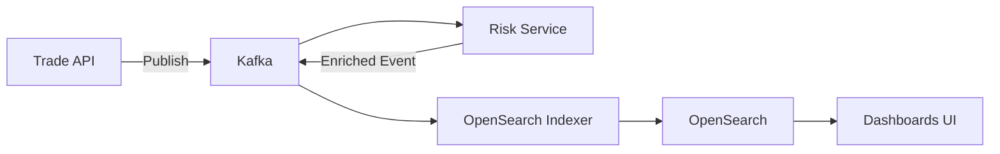
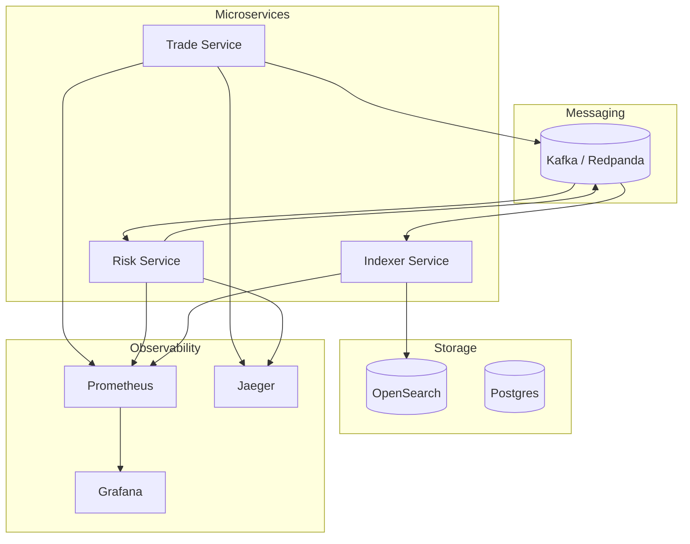
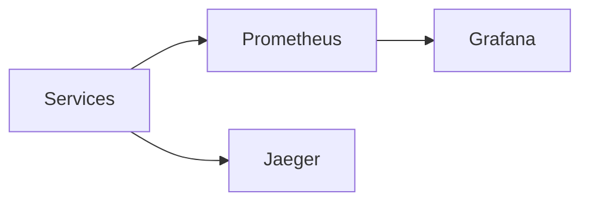

# 🚀 FX Trade Analytics Platform (AWS + OpenSearch)

> A production-style distributed system demonstrating **event-driven FX analytics** with Kafka, OpenSearch, and microservices.

---

## 🎬 System Overview



---

## 📚 Table of Contents

- Overview
- Architecture
- Developer Quick Start
- Daily Usage
- System Components
- Observability
- Key URLs

---

## 🧠 Architecture (Detailed)



---

## ⚡ Developer Quick Start

```bash
npm install
chmod +x devops/local/*.sh
docker network create fx-trade-analytics-aws-opensearch-network
npm run local:start
```

---

## 🔁 Daily Usage

### 🚀 Start everything

```bash
npm run local:start
```

### 🔍 Check status

```bash
npm run local:status
```

### 🛑 Stop everything

```bash
npm run local:stop
```

---

## 🧱 System Components

| Component | Description |
|----------|------------|
| Trade Service | Ingest FX trades |
| Risk Service | Calculates risk |
| Indexer | Pushes to OpenSearch |
| Kafka | Event backbone |
| OpenSearch | Analytics store |
| Grafana | Metrics dashboards |
| Prometheus | Metrics collection |
| Jaeger | Distributed tracing |

---

## 📊 Observability Stack



---

## 🌐 Key URLs

| Service | URL |
|--------|-----|
| Trade API | http://localhost:8080 |
| Risk Service | http://localhost:8081 |
| Indexer | http://localhost:8082 |
| OpenSearch | http://localhost:9200 |
| Dashboards | http://localhost:5601 |
| Kafka UI | http://localhost:8080 |
| Grafana | http://localhost:3000 |
| Prometheus | http://localhost:9090 |
| Jaeger | http://localhost:16686 |

---

## 🎯 One Command Control

```bash
npm run local:start
npm run local:status
npm run local:stop
```

---

## 🔥 Highlights

- Event-driven microservices architecture
- Real-time analytics pipeline
- Multi-service orchestration with one command
- Production-style observability stack

---

## 🚀 Next Enhancements

- AWS multi-region deployment
- Advanced dashboards
- Kafka DLQ + replay
- Authentication + RBAC
